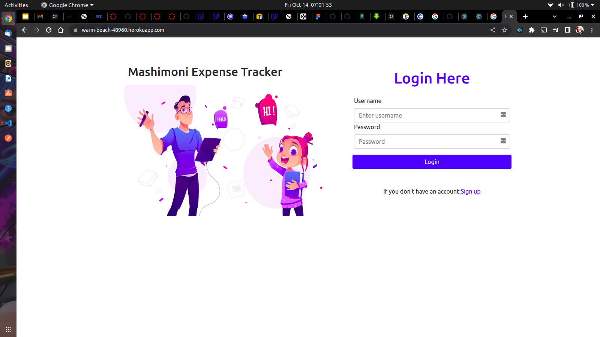
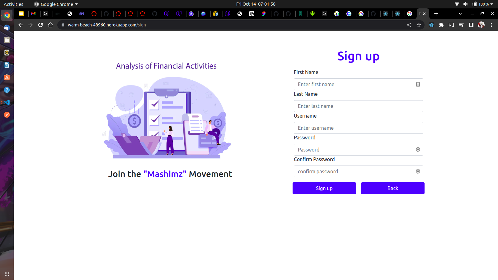

# MASHIMONI EXPENSE TRACKER

   ## By Donald Brooks

## Screenshot
   
   

## Table of Content

- [Description](#description)
- [Features](#features)
- [Requirements](#requirements)
- [Installation Process](#installation-Process)
- [Live link](#Live-Link)
- [Technology Used](#technology-Used)
- [Licence](#licence)
- [Authors Info](#Authors-info)

## Description

 
This project is a REACT/RUBY application that tracks the budget expenses in a monthly setting, organizing each into categories for easu access

## Features

As a user of the application,you will be able to :

1. Add an expense
2. Signup as a new user
3. Login as a newly created user
4. update budget

 ###  Requirements

 * Access to  a computer or any other garget

 * Access to internet

### Installation Process

 ****  
* Clone to the repo : git clone https://github.com/brooksd/expenses-tracker-project.git

* Unzip the downloaded files in a folder of choice.

* Open the index file from the zipped file with any browser.

### Live Link
* The live link for the project is https://warm-beach-48960.herokuapp.com/

### Technology  Used
* REACT - For the frontend

* CSS - which was used to style the User Interface.

* Bootstrap - which was used to create a responsive navbar

* Ruby - For backend and database

MIT License

Copyright (c) [2022] [Donald Brooks]

Permission is hereby granted, free of charge, to any person obtaining a copy
of this software and associated documentation files (the "Software"), to deal
in the Software without restriction, including without limitation the rights
to use, copy, modify, merge, publish, distribute, sublicense, and/or sell
copies of the Software, and to permit persons to whom the Software is
furnished to do so, subject to the following conditions:

The above copyright notice and this permission notice shall be included in all
copies or substantial portions of the Software.

THE SOFTWARE IS PROVIDED "AS IS", WITHOUT WARRANTY OF ANY KIND, EXPRESS OR
IMPLIED, INCLUDING BUT NOT LIMITED TO THE WARRANTIES OF MERCHANTABILITY,
FITNESS FOR A PARTICULAR PURPOSE AND NONINFRINGEMENT. IN NO EVENT SHALL THE
AUTHORS OR COPYRIGHT HOLDERS BE LIABLE FOR ANY CLAIM, DAMAGES OR OTHER
LIABILITY, WHETHER IN AN ACTION OF CONTRACT, TORT OR OTHERWISE, ARISING FROM,
OUT OF OR IN CONNECTION WITH THE SOFTWARE OR THE USE OR OTHER DEALINGS IN THE
SOFTWARE.

## Authors Info

LinkedIn - [Donald Brooks](https://www.linkedin.com/brooksdonald/)
